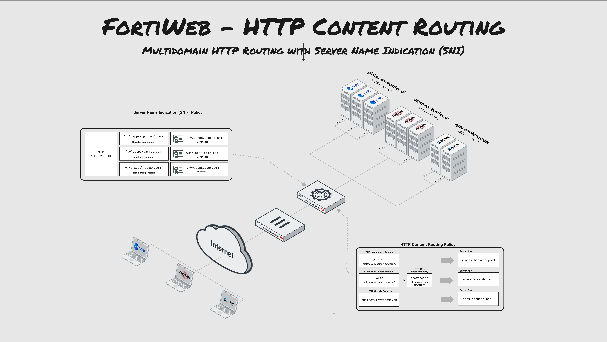

# FortiWeb - SNI Based Certificate Selection 

The SNI Based Certificate Selection describes a scenario where Multiple DNS Domains are mapped to the same virtual-ip of the FortiWeb where the TCP Hello packet and Server Name Indication (SNI) is used to select the correct SSL/TLS Certificate for each Domain. In this Demo we have three company websites — **www.aspex.com**, **www.acme.com**, and **www.globex.com** — are hosted on the same web server. All three domain names resolve to the same IP address and are protected by individual SSL/TLS certificates.

gagag

## SSL/TLS with Multiple DNS Domains

Since the web server hosts three different domains on a single IP address, the challenge lies in handling HTTPS traffic correctly. When a client initiates a secure connection, such as accessing **https://www.globex.com**, the server must present the correct SSL/TLS certificate that matches the requested domain.

However, because HTTPS traffic is encrypted, the server cannot determine which domain the client is requesting until it begins decrypting the connection — which requires the correct certificate to start with. If the server presents the wrong certificate, the SSL/TLS handshake will fail. This creates a classic "chicken-and-egg" problem.

## Server Name Indication (SNI)

This is where **Server Name Indication (SNI)** solves the problem. SNI is an extension to the SSL/TLS protocol that allows the client to indicate the hostname it is trying to reach during the initial handshake.

All modern web browsers (except Internet Explorer on some older platforms) support SNI and send the requested domain name as part of the **Client Hello** message in plaintext. Because this part of the transmission is not encrypted, the web server — or any firewall performing SSL inspection — can read the requested domain name and select the appropriate SSL/TLS certificate *before* the encrypted session begins.

This ensures that the client receives the correct certificate, allowing the handshake to complete successfully and securing the connection to the right website.

# Demo Setup and Introduction

