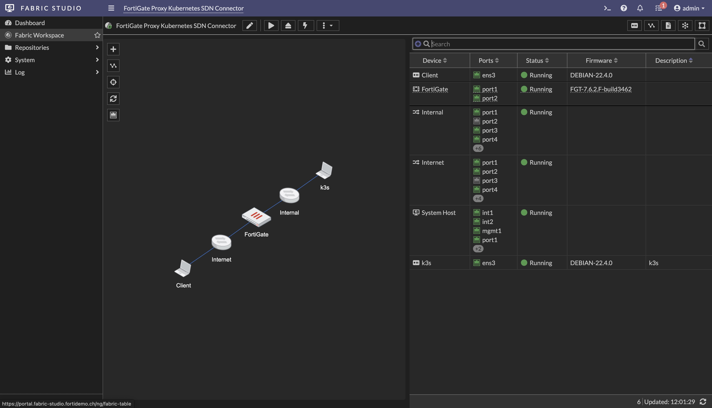

# Demo Guide - FortiGate Proxy with Kubernetes SDN Connector

This demo illustrates the use of FortiGate Explicit Proxy in conjunction with the Kubernetes SDN Connector to dynamically retrieve Kubernetes (K8s) resource objects—including Namespaces, Services, and Containers. These resources are used to define granular Web Proxy firewall policies that enforce egress traffic control for applications running in Kubernetes pods across multiple Namespaces.

This demo showcases the following actions:
- Configuring the Security Fabric Kubernetes SDN Connector
- Create an address object for the toolbox application running in the toolbox kubernetes namesace
- Verify the settings of the pre configured Explicit Proxy
- Create a Firewall Proxy rule for the toolbox application 
- Test egress traffic over the proxy from inide the toolsbox docker container

## Fabric-Studio - Demo Preparation Guide
The following guide explains how the setup a VNC connection from you local machine to the fabric-studio clinet (debcli) and admin (debadm). By using VNC allows to have a better keyboard mapping and screen resolution and overal increased performance.

See [Fabric Studio Setup Guide](fabric-studio-demo-setup-guide.md)

## About the Demo Environment
### FortiGate Explicit Web Proxy
Explicit web proxy can be configured on FortiGate for proxying HTTP and HTTPS traffic. Within this demo, we want do showcase that dockerized application running in kubernetes can be directed to pass egress traffic over a proxy (FortiGate) where the source application can be identified and denied or allowrd with the help of the Kubernetes SDN Connector.

See [FortiGate Explicit Web Proxy](https://docs.fortinet.com/document/fortigate/7.6.2/administration-guide/300428/explicit-web-proxy)

### Kubernetes SDN Connector
FortiOS automatically updates dynamic and cluster IP addresses for Kubernetes (K8s) by using a K8s SDN connector, enabling FortiOS to manage K8s pods as global address objects, as with other connectors. This includes mapping the following attributes from K8s instances to dynamic address groups in FortiOS.

See [Kubernetes (K8s) SDN connectors](https://docs.fortinet.com/document/fortigate/7.6.0/administration-guide/726316/kubernetes-k8s-sdn-connectors)

### Diabling Kubernetes SourceNAT (SNAT)
Most Kubernetes clusters are configured with Source NAT (SNAT) for outbound container traffic. As a result, all egress connections appear with the source IP address of the node hosting the originating pod. This prevents network administrators from creating firewall rules based on individual applications or pods.

Similarly, while the Kubernetes SDN Connector can resolve Kubernetes objects such as Namespaces and Pods, it cannot associate them with the actual IP addresses seen in network traffic due to SNAT.

## Configure the Kubernetes SDN Connector

1. step 1

2.  Since the web server hosts three different domains on a single IP address, the challenge lies in handling HTTPS traffic correctly. When a client initiates a secure connection, such as accessing **https://www.globex.com**, the server must present the correct SSL/TLS certificate that matches the requested domain.

3. However, because HTTPS traffic is encrypted, the server cannot determine which domain the client is requesting until it begins decrypting the connection — which requires the correct certificate to start with. If the server presents the wrong certificate, the SSL/TLS handshake will fail. This creates a classic "chicken-and-egg" problem.

## Server Name Indication (SNI)

This is where **Server Name Indication (SNI)** solves the problem. SNI is an extension to the SSL/TLS protocol that allows the client to indicate the hostname it is trying to reach during the initial handshake.

All modern web browsers (except Internet Explorer on some older platforms) support SNI and send the requested domain name as part of the **Client Hello** message in plaintext. Because this part of the transmission is not encrypted, the web server — or any firewall performing SSL inspection — can read the requested domain name and select the appropriate SSL/TLS certificate *before* the encrypted session begins.

This ensures that the client receives the correct certificate, allowing the handshake to complete successfully and securing the connection to the right website.

# Demo Setup and Introduction

