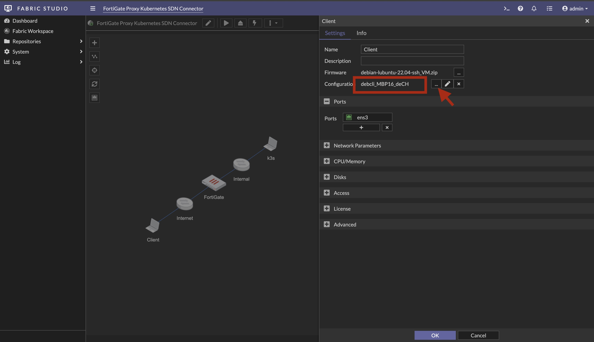
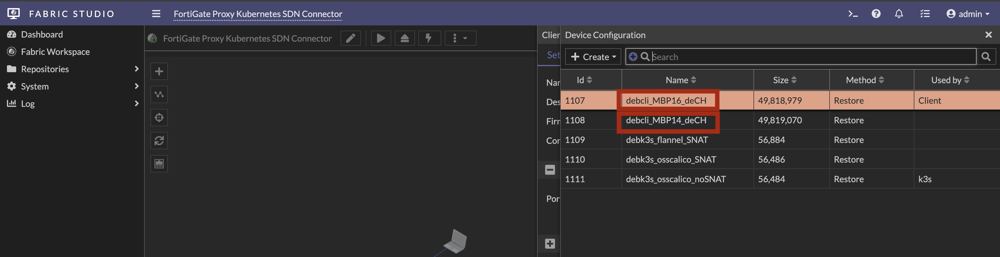
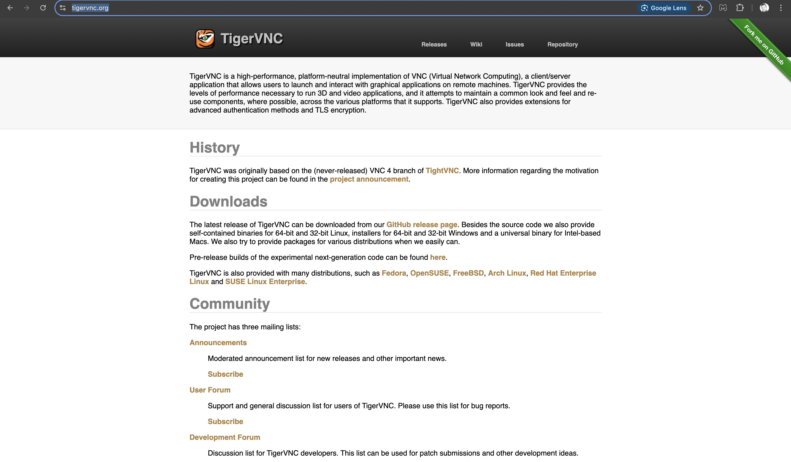

# Fabric Studio - Demo Setup Guide
The following guide explains how the setup a VNC connection from you local machine to the fabric-studio clinet (debcli) and admin (debadm). By using
VNC allows to have a better keyboard mapping and screen resolution and overal increased performance.

## Debian Clients Display Setup
There are currently two different configuraiton files available for debian clients fitting MacBook Pro 14" (debcli_MBP14_deCH) and 16" (debcli_MBP16_deCH) display resolutions. See the following guide that explaines how tp change them. 




## VNC Configuration
For this Fabric all Linux VM's are preconfigured with VNC access enabled and should be right away be available on your local workstation. However, the following commands help you to verify the configuration and to adjust it if neccesary.

### Verify VNC Access Settings in Fabric Studio
Open the CLI in the Fabric Studio and verify the VNC Access parametes for the 'Client' and 'Admin' debian systems.
```
(fabric-studio) # model fabric vm access list 'FortiADC Deploy SLB with Ansible' 'Admin' --select type=VNC
37 Default VNC PUBLIC access to Admin

(fabric-studio) # model fabric vm access list 'FortiADC Deploy SLB with Ansible' 'Client' --select type=VNC
41 Default VNC PUBLIC access to Client
```
In the case the output of the command show 'VNC PRIVATE access' for either the 'Admin0 or the 'Client0 system, the execure the
following command to modify it to 'VNC PUBLIC access'
```
(fabric-studio) # model vm access update 37 '{"mode": "PUBLIC"}'
37 Default VNC PUBLIC access to Admin
```

```
(fabric-studio) # system security preferences get
console="vnc_public_allowed='yes' spice_public_allowed='yes' public_password='required'" password="minimum_length=8 common_check='yes' numeric_check='yes' similarity_check='yes' complexity_check='yes'" ssh_public_allowed='yes' http_public_allowed='no' https_public_allowed='no' custom_rules_allowed='yes' web_session_age=3600 cli_session_timeout=900
```
Be aware that you need to redeploy your devices if you change the fabric access parameters. 

### Verify VNC Access Settings on your workstation
If the Fabric Access Parameters for VNC are set correctly, the VNC ports should be available on your macbook. With the following command you can verify the available VNC ports. In the following example port 14001 and 14004 are available which are releated to your fabric deployment. In this scenario debcli (Debian Client) is available on 14001 and debadm Debian (Admin) is on 14004.
```
macbook:~ $ for p in {14000..14005}; do nc -z portal.fabric-studio.fortidemo.ch $p; done
Connection to portal.fabric-studio.fortidemo.ch port 14001 [tcp/*] succeeded!
Connection to portal.fabric-studio.fortidemo.ch port 14004 [tcp/*] succeeded!
```

### Install TigerVNC
its highly recommended to installa TigerVNC (https://tigervnc.org/) on your MacBook as it brings the best keyboard mappings and compatiblity to apple devices. 




